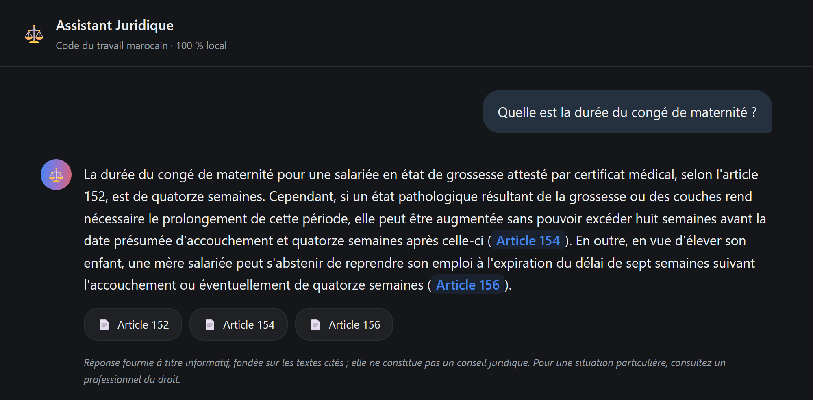

<div align="center">

# Assistant juridique souverain

**Un système RAG qui répond aux questions de droit du travail marocain — en citant ses sources, en refusant de répondre hors périmètre, et sans qu'aucune donnée ne quitte la machine.**

<sub><i>A sovereign RAG assistant over Moroccan labour law: every answer cites its legal sources, abstains when out of scope, and runs 100 % locally.</i></sub>

<p>


</p>



</div>

---

## Le problème

Le Code du travail marocain est public, mais illisible pour qui n'est pas juriste : 589 articles qui se renvoient les uns aux autres. Un assistant généraliste ne comble pas ce manque — il connaît mal le droit marocain, **invente des numéros d'articles plausibles mais faux**, et fait sortir la question du citoyen du territoire.

Un numéro d'article inventé est plus dangereux qu'un « je ne sais pas » : rien, dans sa forme, ne le distingue d'une vraie référence.

## L'approche

```
Question en langage naturel
        │
        ▼
Recherche hybride  ──────  dense (BGE-M3 + Chroma) + lexicale (BM25), fusion RRF
        │
        ▼
◇ Garde-fou d'abstention  ─  test de seuil AVANT le modèle : indépendant du LLM
        │ oui                 (si non → abstention en 0,13 s, le modèle n'est jamais appelé)
        ▼
Génération ancrée  ───────  Mistral 7B local, prompt strict, température 0,1
        │
        ▼
Contrôle des citations  ──  chaque numéro cité est-il vraiment dans le contexte fourni ?
        │
        ▼
Réponse citée + avertissement d'usage
```

Deux décisions structurantes :

- **Le garde-fou est hors du modèle.** C'est un test de seuil, pas une consigne de prompt — il ne dépend pas de la bonne volonté d'un 7B à dire « je ne sais pas ».
- **Recherche et génération restent séparables.** On peut inspecter les articles retrouvés *avant* l'appel au LLM, donc distinguer une erreur de recherche d'une erreur de génération.

## Résultats mesurés

Jeu de référence : **62 questions** (53 dans le périmètre, 9 hors périmètre), toutes étiquetées à la main contre le texte réel du corpus.

**Qualité de la recherche** — `python eval/run_eval.py`

| Méthode | Recall@5 | MRR |
|---|---:|---:|
| Dense seul | 0,849 | **0,778** |
| BM25 seul | 0,660 | 0,535 |
| **Hybride (RRF)** | **0,868** | 0,775 |

**Qualité des réponses** — `python eval/run_measures.py`

| Critère | Résultat |
|---|---|
| Citation systématique | **96 %** (49/51) |
| L'article attendu est cité | **88 %** (45/51) |
| Abstention correcte hors périmètre | **100 %** (9/9) |
| Citations vérifiées présentes dans le contexte | 81 % (77/95) |
| Refus à tort | 2/53 |
| Répond alors qu'il devrait s'abstenir | **0** |
| Latence médiane | 3,98 s — dont 0,16 s de recherche |
| Latence en cas d'abstention | 0,13 s |

## Le résultat le plus intéressant : mon banc de test se trompait

Une première version du jeu de référence comptait 37 questions et donnait un résultat net : **la recherche dense battait l'hybride** (0,969 contre 0,875). C'était mesuré, reproductible — et faux.

Un audit de couverture a montré que ce jeu n'exerçait pas plusieurs chemins du code. Aucune de ses 37 questions ne nommait un article par son numéro, alors que `retriever.py` contient une branche dédiée à ce cas. Trois Livres du corpus sur huit n'étaient couverts par aucune question.

Après élargissement à 62 questions ciblant exactement ces angles morts, **la conclusion s'inverse** — sans qu'une seule ligne du moteur ait changé :

| Méthode | 37 questions | 62 questions |
|---|---:|---:|
| Dense seul | **0,969** | 0,849 |
| BM25 seul | 0,781 | 0,660 |
| Hybride (RRF) | 0,875 | **0,868** |

Les 32 questions d'origine étaient toutes des reformulations en langage courant — la configuration exactement favorable aux embeddings. Le dense ne gagnait pas parce qu'il est meilleur, mais parce qu'on ne lui posait que les questions qu'il sait traiter.

Le même biais faussait la calibration du seuil d'abstention : avec 5 questions hors périmètre, les bandes de score paraissaient nettement séparées. Avec 9, **elles se recouvrent** — « conditions pour obtenir un passeport marocain » score 0,603, au-dessus de la question de droit du travail la moins bien classée (0,596). Aucun seuil unique ne peut les séparer.

> **La leçon :** un banc d'évaluation est un artefact conçu, avec ses angles morts. Tant que sa couverture n'a pas été auditée, il mesure les hypothèses de son auteur autant que le système qu'il juge.

## Choix techniques

| Couche | Choix | Pourquoi |
|---|---|---|
| Extraction PDF | PyMuPDF | Contrôle direct du découpage, là où un parseur automatique le masque |
| Embeddings | BGE-M3 | Local (la souveraineté exclut les API), FR + AR, contexte 8192 jetons |
| Base vectorielle | Chroma | Embarquée, persistante ; à 589 articles la performance est hors sujet |
| Recherche lexicale | BM25 (`rank_bm25`) | Les requêtes juridiques sont riches en jetons exacts |
| LLM | Mistral 7B via Ollama | Local ; la classe 7B est le point d'équilibre qualité / matériel ordinaire |
| Cadriciel RAG | **aucun** | ~150 lignes ; l'écrire soi-même permet de déboguer et de l'expliquer |

## Ce que le projet garantit

- **Corpus reproductible.** Un clone vierge + `python src/parser.py` régénère un corpus **identique octet pour octet**, vérifié par empreinte SHA-256.
- **Aucun chiffre saisi à la main.** Tous les nombres du rapport, texte et figures compris, sont générés depuis les fichiers de mesure par `rapport/build_data.py`.
- **Captures d'écran réelles.** Les images de ce README sont produites par `eval/capture_ui.js`, qui pilote un navigateur sans affichage et pose réellement les questions au moteur.
- **Limites documentées.** Le contrôle des citations est *syntaxique* : il vérifie qu'un article cité figurait dans le contexte, pas qu'il dise ce que la réponse lui attribue.

<div align="center">

<br><sub>Hors périmètre : phrase d'abstention exacte, aucune source, aucun contenu inventé.</sub>
</div>

## Installation

```bash
git clone https://github.com/taha-elbadaoui/Sovereign-Legal-RAG-Assistant.git
cd Sovereign-Legal-RAG-Assistant
python -m venv .venv
.venv\Scripts\activate          # Windows · source .venv/bin/activate sur macOS/Linux
pip install -r requirements.txt
ollama pull mistral:7b          # https://ollama.com/download
```

## Utilisation

**Préparation** (une fois — construit le corpus puis l'index vectoriel) :

```bash
python src/parser.py            # PDF → 589 articles JSONL
python src/database.py          # corpus → index Chroma (télécharge BGE-M3, ~2,2 Go)
```

**Interface web** (nécessite Node.js pour la première construction) :

```bash
cd web && npm install && npm run build && cd ..
python serve.py                 # puis http://localhost:8000
```

**Ligne de commande** — expose toute la traçabilité : score de recherche, articles retrouvés, citations non vérifiées.

```bash
python src/app.py "Un employeur peut-il licencier une salariée enceinte ?"
python src/retriever.py "Quelle est la durée du congé annuel payé ?"   # recherche seule
python demo.py                  # démonstration scriptée, 8 scènes
```

**Évaluation** :

```bash
python eval/run_eval.py         # Recall@k, MRR — sans LLM
python eval/run_measures.py     # latence, taxonomie, figures — avec LLM
python rapport/build_data.py    # mesures → chiffres et données de figures du rapport
```

## Structure du dépôt

```
src/
  parser.py         PDF → corpus JSONL (extraction, hiérarchie, nettoyage)
  database.py       corpus → index vectoriel Chroma
  retriever.py      recherche hybride : dense + BM25 + RRF, renvoi par numéro explicite
  generator.py      génération ancrée via Ollama
  app.py            orchestrateur : abstention + contrôle des citations
eval/
  reference_qa.jsonl    jeu de référence, 62 questions étiquetées
  run_eval.py           métriques de recherche, sans LLM
  run_measures.py       latence, taxonomie, figures
  capture_ui.js         captures d'écran de l'interface, via CDP sans dépendance npm
  crop_captures.py      recadrage des captures sur la zone de conversation
rapport/            rapport de stage LaTeX (57 pages, 13 figures vectorielles)
  build_data.py     mesures → macros LaTeX et coordonnées de figures
web/                interface React (Vite)
JOURNAL.md          carnet de bord quotidien : décisions, bugs, impasses
```

## Périmètre assumé

Ce système relève de la **restitution d'information juridique**, pas du conseil juridique personnalisé — chaque réponse le rappelle. Quatre interdictions tenues du premier au dernier jour : pas de *fine-tuning*, pas de mémoire multi-tours, pas d'autre code que le Code du travail, aucune API externe dans le cœur du système.

---

<div align="center">
<sub>Stage de fin de première année · <b>INPT</b>, filière ASEDS · <b>Pulsaride Solutions</b> · juillet–août 2026<br>
Journal de bord détaillé : <a href="JOURNAL.md">JOURNAL.md</a></sub>
</div>
