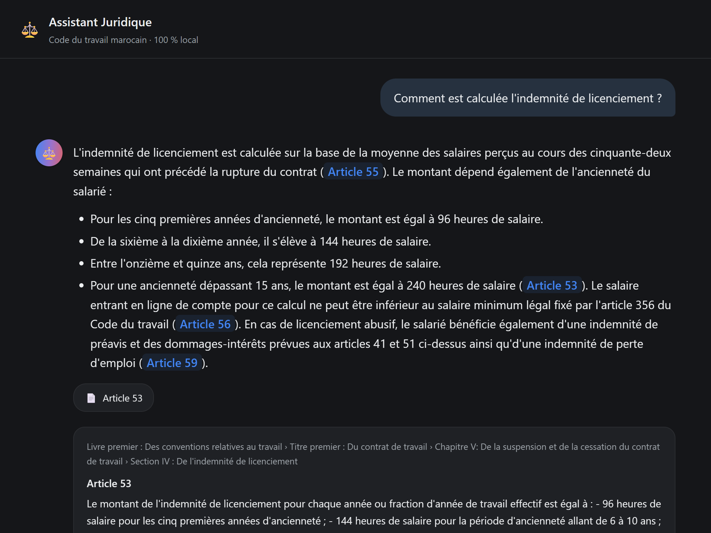

<div align="center">


# ⚖️ Assistant juridique souverain

**Un RAG sur le Code du travail marocain qui cite ses sources, refuse de répondre hors périmètre, et ne fait sortir aucune donnée de la machine.**

<sub><i>A sovereign RAG assistant over Moroccan labour law — every answer cites its legal sources, abstains when out of scope, runs 100% locally.</i></sub>

<p>


</p>

<p>


</p>


</div>

<br>

## 🎯 Le problème

Le Code du travail marocain est public — mais illisible pour qui n'est pas juriste : 589 articles qui se renvoient les uns aux autres. Un assistant généraliste ne comble pas ce manque : il connaît mal le droit marocain, **invente des numéros d'articles plausibles mais faux**, et fait sortir la question du citoyen du territoire.

Un article inventé est plus dangereux qu'un « je ne sais pas » : rien dans sa forme ne le distingue d'une vraie référence.

## ⚙️ L'approche

```
Question en langage naturel
        │
        ▼
Recherche hybride  ──────  dense (BGE-M3 + Chroma) + lexicale (BM25), fusion RRF
        │
        ▼
◇ Garde-fou d'abstention  ─  test de seuil AVANT le modèle, indépendant du LLM
        │ oui                 (si non → abstention en 0,13 s, le modèle n'est jamais appelé)
        ▼
Génération ancrée  ───────  Mistral 7B local, prompt strict, température 0,1
        │
        ▼
Contrôle des citations  ──  chaque numéro cité est-il vraiment dans le contexte fourni ?
        │
        ▼
Réponse citée + avertissement d'usage
```

**Deux paris structurants :**

| | |
|---|---|
| 🚧 **Garde-fou hors du modèle** | Test de seuil, pas une consigne de prompt — ne dépend pas de la bonne volonté d'un 7B à dire « je ne sais pas » |
| 🔍 **Recherche ≠ génération** | Les articles retrouvés s'inspectent *avant* l'appel au LLM : une mauvaise réponse se diagnostique en une étape |

<div align="center">

<br><sub>Chaque citation se déplie : texte légal réel + position exacte dans la loi.</sub>
</div>

## 📈 Résultats mesurés

62 questions de référence (53 dans le périmètre, 9 hors périmètre), étiquetées à la main contre le texte réel du corpus.

<div align="center">


</div>

**Qualité de la recherche** — `python eval/run_eval.py`

| Méthode | Recall@5 | MRR |
|---|---:|---:|
| Dense seul | 0,849 | **0,778** |
| BM25 seul | 0,660 | 0,535 |
| **Hybride (RRF)** | **0,868** | 0,775 |

**Qualité des réponses** — `python eval/run_measures.py`

| Critère | Résultat |
|---|---|
| Citation systématique | **96 %** (49/51) |
| L'article attendu est cité | **88 %** (45/51) |
| Abstention correcte hors périmètre | **100 %** (9/9) |
| Citations vérifiées présentes dans le contexte | 81 % (77/95) |
| Répond alors qu'il devrait s'abstenir | **0** |
| Refus à tort | 2/53 |
| Latence médiane | 3,98 s — dont 0,16 s de recherche |
| Latence en cas d'abstention | **0,13 s** |

<div align="center">

<br><sub>Hors périmètre : phrase exacte, aucune source, aucun contenu inventé.</sub>
</div>

## 🔬 Le twist : mon jeu de test m'a menti

Version 1 du jeu de référence : 37 questions, résultat net — **le dense battait l'hybride** (0,969 contre 0,875). Mesuré, reproductible, et faux.

Un audit de couverture a montré pourquoi : ces 37 questions étaient **toutes** des reformulations en langage courant, aucune ne nommait un article par son numéro (alors que `retriever.py` a une branche dédiée à ce cas), et 3 Livres du corpus sur 8 n'étaient couverts par rien.

Élargissement ciblé à 62 questions, aucune ligne du moteur touchée :

| Méthode | 37 questions | 62 questions |
|---|---:|---:|
| Dense seul | **0,969** | 0,849 |
| Hybride (RRF) | 0,875 | **0,868** ⬆️ |

**Le classement s'inverse.** Le dense ne gagnait pas parce qu'il était meilleur — il gagnait parce qu'on ne lui posait que les questions qu'il sait traiter. Même chose sur le seuil d'abstention : avec 5 questions hors périmètre les bandes de score semblaient nettement séparées ; avec 9, **elles se recouvrent** (« passeport marocain » à 0,603, au-dessus de la question de droit du travail la plus faible à 0,596).

Un banc de test mal couvert ne mesure pas le système — il mesure les angles morts de celui qui l'a écrit.

## 🧰 Choix techniques

| Couche | Choix | Pourquoi |
|---|---|---|
| Extraction PDF | PyMuPDF | Contrôle direct du découpage, là où un parseur automatique le masque |
| Embeddings | BGE-M3 | Local (souveraineté = pas d'API), FR + AR, contexte 8192 jetons |
| Base vectorielle | Chroma | Embarquée, persistante ; à 589 articles la perf brute est hors sujet |
| Recherche lexicale | BM25 (`rank_bm25`) | Requêtes juridiques riches en jetons exacts — là où le lexical bat les embeddings |
| LLM | Mistral 7B via Ollama | Local ; classe 7B = point d'équilibre qualité / matériel ordinaire |
| Cadriciel RAG | **aucun** | ~150 lignes ; l'écrire soi-même = pouvoir déboguer chaque étape |

## ✅ Ce que le projet garantit

- **Corpus reproductible.** Clone vierge + `python src/parser.py` → corpus **identique octet pour octet**, vérifié par empreinte SHA-256.
- **Zéro chiffre saisi à la main.** Texte et figures du rapport générés depuis les mesures par `rapport/build_data.py`.
- **Captures d'écran réelles.** Produites par `eval/capture_ui.js` — navigateur sans affichage, vraies questions posées au moteur.
- **Limites documentées.** Le contrôle des citations est *syntaxique* : présence dans le contexte, pas fidélité sémantique.

<br>

<details>
<summary><b>🚀 Installation</b></summary>

```bash
git clone https://github.com/taha-elbadaoui/Sovereign-Legal-RAG-Assistant.git
cd Sovereign-Legal-RAG-Assistant
python -m venv .venv
.venv\Scripts\activate          # Windows · source .venv/bin/activate sur macOS/Linux
pip install -r requirements.txt
ollama pull mistral:7b          # https://ollama.com/download
```

</details>

<details>
<summary><b>▶️ Utilisation</b></summary>

**Préparation** (une fois — construit le corpus puis l'index vectoriel) :

```bash
python src/parser.py            # PDF → 589 articles JSONL
python src/database.py          # corpus → index Chroma (télécharge BGE-M3, ~2,2 Go)
```

**Interface web** (Node.js requis pour la première construction) :

```bash
cd web && npm install && npm run build && cd ..
python serve.py                 # puis http://localhost:8000
```

**Ligne de commande** — expose toute la traçabilité : score de recherche, articles retrouvés, citations non vérifiées.

```bash
python src/app.py "Un employeur peut-il licencier une salariée enceinte ?"
python src/retriever.py "Quelle est la durée du congé annuel payé ?"   # recherche seule
python demo.py                  # démonstration scriptée, 8 scènes
```

**Évaluation** :

```bash
python eval/run_eval.py         # Recall@k, MRR — sans LLM
python eval/run_measures.py     # latence, taxonomie, figures — avec LLM
python rapport/build_data.py    # mesures → chiffres et figures du rapport
```

</details>

<details>
<summary><b>📂 Structure du dépôt</b></summary>

```
src/
  parser.py         PDF → corpus JSONL (extraction, hiérarchie, nettoyage)
  database.py       corpus → index vectoriel Chroma
  retriever.py      recherche hybride : dense + BM25 + RRF, renvoi par numéro explicite
  generator.py      génération ancrée via Ollama
  app.py            orchestrateur : abstention + contrôle des citations
eval/
  reference_qa.jsonl    jeu de référence, 62 questions étiquetées
  run_eval.py            métriques de recherche, sans LLM
  run_measures.py        latence, taxonomie, figures
  capture_ui.js           captures d'écran de l'interface, via CDP sans dépendance npm
rapport/            rapport de stage LaTeX (57 pages, 13 figures vectorielles)
  build_data.py     mesures → macros LaTeX et coordonnées de figures
web/                interface React (Vite)
JOURNAL.md          carnet de bord quotidien : décisions, bugs, impasses
```

</details>

<br>

## 🚫 Périmètre assumé

Restitution d'information juridique, pas conseil personnalisé — chaque réponse le rappelle. Quatre interdictions tenues du premier au dernier jour : pas de *fine-tuning*, pas de mémoire multi-tours, pas d'autre code que le Code du travail, aucune API externe dans le cœur du système.

---

<div align="center">
<sub>Stage de fin de première année · <b>INPT</b>, filière ASEDS · <b>Pulsaride Solutions</b> · juillet–août 2026<br>
Journal de bord détaillé : <a href="JOURNAL.md">JOURNAL.md</a></sub>
</div>
