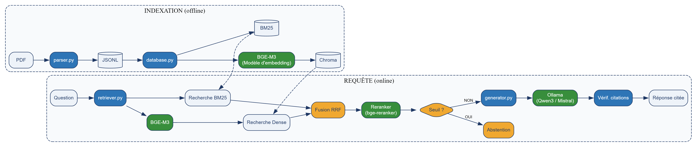

# Assistant Juridique RAG Souverain — Document de conception technique

**Projet :** Assistant conversationnel (RAG) sur le droit du travail marocain (Loi n° 65‑99 — Code du travail), français d'abord, avec citation obligatoire des sources et abstention explicite hors périmètre.
**Cadre :** Stage — Pulsaride Solutions · 8 semaines · démarrage : 1er juillet 2026.
**Contrainte de conception :** local / open‑source (souveraineté des données).

---

## 1. Objectifs du projet

### 1.1 Objectif fonctionnel

Permettre à un citoyen de poser une question en langage naturel sur le droit du travail marocain et d'obtenir une réponse **fondée sur le texte de loi**, **traçable** et **honnête sur ses limites**.

Le système doit, à partir d'une question :

1. **Retrouver** les articles pertinents du Code du travail ;
2. **Générer** une réponse fondée *uniquement* sur ces articles ;
3. **Citer** systématiquement le ou les numéros d'articles utilisés ;
4. **S'abstenir** explicitement lorsque la réponse n'est pas dans le texte ou que la question est hors périmètre.

### 1.2 Périmètre engagé

| Mission | Engagement |
|---|---|
| **Mission 1** | Corpus structuré, reproductible, au niveau de l'article, avec métadonnées. |
| **Mission 2** | Pipeline RAG fonctionnel : question → articles retrouvés → réponse sourcée, sur modèle local. |
| **Mission 3** | Évaluation : jeu de Q/R de référence, métriques de recherche, correction manuelle, analyse d'erreurs. |
| **Mission 4** *(optionnelle)* | Support arabe / darija via une **couche de traduction** greffée sur le système français. |

### 1.3 Non‑objectifs (ce que le système n'est pas)

Le cadrage négatif est aussi important que le cadrage positif :

- Ce n'est **pas** un outil d'**interprétation** ou de **conseil juridique personnalisé**. Il relève de la **restitution d'information juridique**. Chaque réponse porte un avertissement en ce sens.
- Ce n'est **pas** un système qui répond « au mieux » : face à une question sans réponse dans le corpus, **l'abstention est le comportement correct**, pas un échec.
- Ce n'est **pas** un produit : le livrable est le moteur RAG et son évaluation, pas une interface aboutie.

### 1.4 Hors périmètre — interdictions explicites

> ⚠️ Ces limites protègent le stage de l'étalement, qui est le premier risque d'échec sur un délai court. Elles ne sont pas négociables sans validation de l'encadrant.

- **Pas de fine‑tuning du LLM.** Le modèle local est utilisé tel quel (prompting + RAG), jamais réentraîné.
- **Pas de mémoire conversationnelle.** Chaque question est traitée indépendamment ; pas de suivi de dialogue multi‑tour.
- **Pas d'autre code juridique que le Code du travail** (Loi 65‑99) engagé pour le stage.
- **Pas d'interface web complète.** La CLI est le livrable ; une démo Streamlit/Gradio minimale reste un *nice-to-have*, jamais un engagement.
- **Pas de correction/normalisation automatique de l'orthographe** des questions (français, arabe ou darija) au‑delà de la traduction prévue en Mission 4.
- **Pas de veille légale automatisée en production** (cf. §8) — toute mise à jour du corpus reste déclenchée et validée par un humain.

---

## 2. Architecture générale

Le système se décompose en **deux pipelines distincts** : un pipeline d'**indexation** exécuté une seule fois (hors ligne), et un pipeline de **requête** exécuté à chaque question (en ligne).



*Figure 1 — Architecture générale : pipeline d'indexation (hors ligne) et pipeline de requête (en ligne).*

Les index `Chroma` (dense) et `BM25` (lexical), construits hors ligne, sont ceux qu'interrogent respectivement les recherches *Dense* et *BM25* du pipeline de requête — d'où les liens en pointillés entre les deux bandes. Le modèle d'embedding **BGE-M3** intervient deux fois : à l'indexation, pour vectoriser les articles ; à la requête, pour vectoriser la question. C'est ce qui garantit que les deux vivent dans le même espace vectoriel et que la comparaison a un sens.

### 2.1 Deux principes structurants lisibles sur le schéma

- **Le garde‑fou d'abstention est *avant* le LLM.** C'est un test de seuil sur le score de recherche, donc un mécanisme **indépendant du modèle**. Il ne dépend pas de la bonne volonté du LLM de dire « je ne sais pas » — ce sur quoi les petits modèles locaux sont peu fiables.
- **La recherche et la génération sont séparables.** À tout moment on peut afficher les articles retrouvés *avant* l'appel au modèle. La majorité des mauvaises réponses en RAG viennent d'une mauvaise **recherche**, pas d'une mauvaise génération : cette séparation rend le débogage possible.

### 2.2 Extension multilingue (Mission 4) — couche de traduction

Le cœur du système reste **entièrement français** (corpus, embeddings, recherche, génération, citations). L'arabe et la darija sont traités comme une **couche de traduction greffée aux extrémités**, sans toucher au moteur :

```
   Question (AR / darija)
          |   traduction --> FR
          v
   Pipeline RAG francais   (recherche --> articles cites --> generation)
          |   traduction --> AR
          v
   Reponse (AR) + numeros d'articles cites (inchanges, independants de la langue)
```

**Justification :** cette approche isole toute la difficulté de l'arabe (extraction RTL, qualité des embeddings arabes, évaluation d'une réponse juridique arabe) **hors du pipeline principal**. Le « raisonnement » reste dans la langue la mieux maîtrisée par le système.

**Points de vigilance :**
- La traduction de terminologie juridique est délicate ; elle est toutefois plus tolérable à l'étape de *recherche* (il suffit de retrouver le bon article), et la **citation reste le numéro d'article**, indépendant de la langue et donc toujours vérifiable.
- Une réponse arabe passe par une traduction du français → usage **informatif** assumé, jamais du conseil juridique.
- **Variante à évaluer :** BGE‑M3 étant nativement multilingue, une requête arabe peut parfois retrouver directement l'article français pertinent (**recherche translingue sans traduction explicite**). À comparer avec l'approche par traduction.

---

## 3. Composants et leurs interactions

### 3.1 Rôle de chaque module

| Module | Rôle | Entrée | Sortie | Phase |
|---|---|---|---|---|
| `parser.py` | Extraction PDF, découpage par article, métadonnées | PDF source | `corpus_chunks.jsonl` | Indexation |
| `database.py` | Calcul des embeddings, construction des index | `corpus_chunks.jsonl` | Collection Chroma persistante + index BM25 | Indexation |
| `retriever.py` | Recherche dense + lexicale, fusion, reranking | Question, `k` | Liste de chunks + scores | Requête |
| `generator.py` | Prompt ancré, appel au LLM, vérification des citations | Question + chunks | Réponse + citations | Requête |
| `app.py` | Orchestration, garde‑fou d'abstention, interface (CLI) | Question utilisateur | Réponse affichée | Requête |

### 3.2 Séquence d'une requête

1. `app.py` reçoit la question de l'utilisateur.
2. `app.py` appelle `retriever.retrieve(question, k)`.
3. `retriever.py` vectorise la question avec **BGE-M3** (le même modèle qu'à l'indexation), puis interroge **en parallèle** la base vectorielle Chroma (recherche sémantique) et l'index BM25 (recherche lexicale), et **fusionne** les deux classements par *reciprocal rank fusion*.
4. *(Optionnel)* Le reranker cross‑encodeur réordonne les top‑k et n'en garde que les top‑n les plus précis.
5. `app.py` applique le **garde‑fou** : si le meilleur score est sous le seuil calibré → **abstention immédiate**, le LLM n'est pas appelé.
6. Sinon, `app.py` appelle `generator.generate(question, chunks)`.
7. `generator.py` construit un prompt strict (« réponds uniquement à partir des articles ci‑dessous ; cite leur numéro ; si l'information n'y est pas, dis‑le »), appelle Ollama à basse température, puis **vérifie que chaque numéro d'article cité figure bien dans le contexte fourni**.
8. `app.py` affiche la réponse, les articles cités, et l'avertissement d'usage.

### 3.3 Découplage et interchangeabilité

Chaque composant est isolé derrière une fonction simple, ce qui permet de **remplacer une brique sans toucher aux autres** :

- Changer de modèle d'embeddings ⇒ `database.py` **et** `retriever.py` (les deux doivent impérativement utiliser le même modèle, sinon question et articles ne vivent plus dans le même espace vectoriel). Le modèle est donc chargé derrière une interface unique et partagée.
- Changer de LLM (Qwen3 → Mistral) ⇒ seul `generator.py` change.
- Passer du dense seul à l'hybride ⇒ seul `retriever.py` change.

Cette contrainte est délibérée : elle rend l'**évaluation comparative** (Mission 3) possible — on mesure une variante à la fois.

---

## 4. Technologies et outils utilisés

### 4.1 Les deux filtres derrière chaque choix

Presque toutes les décisions découlent de deux contraintes. Elles suffisent à justifier la quasi‑totalité du tableau :

1. **Souveraineté → tout doit tourner en local / open‑source.** Ce seul critère élimine toutes les options par API : embeddings OpenAI/Cohere, Cohere Rerank, génération GPT‑4/Claude/Gemini, et RAGAS avec un juge dans le cloud. Beaucoup de « pourquoi pas X ? » se résument à : *« X est une API ; la question du citoyen ne doit pas quitter le pays. »*
2. **Corpus borné (~quelques milliers de chunks) + 8 semaines → optimiser la compréhension et la maîtrise, pas la performance à grande échelle.** À cette taille, **toutes** les bases vectorielles sont instantanées : la performance brute n'est jamais le facteur décisif.

### 4.2 Décisions par composant

| Couche | Choix | Alternatives écartées | Justification |
|---|---|---|---|
| Langage / env. | Python 3.11 + `venv` | JS/Node, Rust | L'écosystème ML/NLP/RAG est Python‑first. Pas un vrai débat. |
| Extraction PDF | **PyMuPDF** (`fitz`), `pdfplumber` en secours | pypdf, pdfminer, `unstructured` | Rapide, fidélité Unicode/accents fiable. Surtout : **contrôle brut sur la façon dont la loi est découpée** — les parseurs automatiques masquent ce contrôle. |
| Embeddings | **BGE‑M3** | OpenAI/Cohere (API), multilingual‑e5, MiniLM | La souveraineté exclut les embeddings par API. Parmi les modèles locaux : meilleure couverture FR + AR, **contexte long (8192 tokens → aucun article tronqué)**, forte qualité de recherche. |
| Base vectorielle | **Chroma** (persistante) | FAISS, Qdrant, Milvus, pgvector | À ~quelques milliers de chunks la performance est hors sujet → j'ai optimisé l'expérience de développement. Chroma est **embarquée** (pas de serveur), persiste sur disque, filtre par métadonnées avec une API triviale. |
| Recherche lexicale | **BM25** (`rank_bm25`) + fusion RRF avec le dense | Dense seul | Les requêtes juridiques sont riches en **tokens exacts** (numéros d'articles, « Loi 65‑99 », vocabulaire figé) — précisément là où le lexical bat les embeddings. ~20 lignes de code, et cela produit une **comparaison mesurée dense / BM25 / hybride**. |
| Reranker *(option)* | `bge-reranker-v2-m3` | Cohere Rerank (API) | Un cross‑encodeur lit le couple (question, passage) conjointement → plus précis. Récupérer les 10 meilleurs candidats, puis les reclasser pour n'en garder que 3 → contexte plus propre. Même famille que BGE‑M3, multilingue, **local**. |
| Runtime LLM local | **Ollama** | llama.cpp brut, vLLM, transformers | Une commande télécharge et sert un modèle quantifié via une API propre. vLLM vise la haute concurrence, inutile pour un utilisateur unique. |
| Modèle LLM | **Qwen3 8B** ou **Mistral 7B** | GPT‑4/Claude (API), Llama 3.x 8B, 70B, ≤4B | La souveraineté exclut les API frontière. La classe 7‑8B est le point d'équilibre : suffisante en suivi d'instructions, exécutable sur du matériel étudiant. Qwen si l'arabe entre en jeu ; Mistral si français strict. |
| Framework RAG | **Aucun** (implémentation à la main) | LangChain, LlamaIndex | Pour **un corpus borné**, la boucle RAG fait ~150 lignes. La coder soi‑même = comprendre chaque étape, déboguer directement, et **expliquer son propre pipeline en soutenance** plutôt que « le framework le fait ». |
| Évaluation | Scripts + `pandas` + correction manuelle | RAGAS comme évaluateur principal | Sur 30–50 questions, **lire chaque réponse** est plus honnête qu'un juge LLM. Les métriques de recherche (recall@k, MRR) sont automatisées car les identifiants d'articles de référence les rendent objectives. |
| Format du corpus | **JSONL** | CSV, Parquet, base de données | Un chunk par ligne : lisible, métadonnées imbriquées, **diff‑able sous Git**, lecture en flux. CSV s'étrangle sur du texte contenant virgules et retours à la ligne ; Parquet est binaire ; une BDD est une indirection inutile pour un corpus statique versionné. |
| UI *(option)* | Streamlit / Gradio | Application web React/Flask | Transforme une fonction Python en démo web en quelques minutes. Le livrable est le moteur RAG, pas une interface produit. |

### 4.3 Les appels réellement discutables (assumés)

Ce ne sont pas des « vrai/faux » — voici le choix, et le cas légitime de l'alternative :

- **BGE‑M3 vs multilingual‑e5** — appel serré ; e5 est plus léger et plus simple. BGE‑M3 l'emporte sur la largeur multilingue et le contexte long.
- **Chroma vs pgvector** — pgvector joue sur ma familiarité SQL et fonctionnerait très bien ; j'ai choisi Chroma pour **zéro ops**.
- **Qwen3 vs Mistral vs Llama 3.x 8B** — tous défendables ; l'arbitre est la langue prioritaire.
- **Sans framework vs LlamaIndex** — l'appel le plus discutable. Un framework se justifie si le projet grossit (sources multiples, agents, routage). **Si l'acquisition de LangChain/LlamaIndex est un objectif de formation en soi, cette décision change.**
- **Dense seul vs hybride** — l'hybride est peu coûteux et le texte juridique favorise le *matching* exact ; mais la position honnête est *« je l'ai mesuré, voici le delta »* — et si le delta est nul, le retirer est le bon choix.

---

## 5. Structure du projet et étapes de mise en place

### 5.1 Arborescence

```
sovereign-legal-rag/
├── data/
│   ├── raw/                        # PDF sources (Code du travail FR + AR)
│   └── processed/
│       └── corpus_chunks.jsonl     # Corpus structuré, prêt à indexer
├── docs/                           # Conception, analyses, arbitrages
├── eval/
│   ├── reference_qa.jsonl          # 30 à 50 couples Q/R de référence
│   └── run_eval.py                 # Calcul des métriques (recall@k, MRR...)
├── src/
│   ├── parser.py                   # Extraction & structuration      (Mission 1)
│   ├── database.py                 # Embeddings & base vectorielle   (Mission 2)
│   ├── retriever.py                # Recherche dense + BM25          (Mission 2)
│   ├── generator.py                # Prompt, abstention, citations   (Mission 2)
│   └── app.py                      # Point d'entrée (CLI / Streamlit)
├── JOURNAL.md                      # Carnet de bord quotidien
├── README.md                       # Guide d'installation et d'exécution
└── requirements.txt                # Dépendances épinglées
```

### 5.2 Environnement et ressources

- Python 3.11
- [Ollama](https://ollama.com) installé localement
- Matériel : GPU NVIDIA ≥ 6 Go de VRAM, ou Apple Silicon ≥ 16 Go de RAM. À défaut, exécution CPU possible (plus lente) avec un modèle plus petit (Qwen3 4B).
- Espace disque : ~10 Go (modèle quantifié + dépendances Python + corpus).
- Accès réseau uniquement pour l'installation initiale (téléchargement des modèles) ; le fonctionnement en régime établi est **entièrement hors ligne**.

### 5.3 Installation

```bash
git clone https://github.com/taha-elbadaoui/Sovereign-Legal-RAG-Assistant.git
cd Sovereign-Legal-RAG-Assistant

python -m venv .venv
.venv\Scripts\activate          # Windows
# source .venv/bin/activate     # macOS / Linux

pip install -r requirements.txt
ollama pull qwen3:8b
```

### 5.4 Exécution

```bash
python src/parser.py     # 1. Construire le corpus       -> corpus_chunks.jsonl
python src/database.py   # 2. Indexer (embeddings + BM25) -> base Chroma persistante
python src/app.py        # 3. Poser une question (CLI)
python eval/run_eval.py  # 4. Lancer l'évaluation
```

Le projet doit être **reconstructible depuis un clone vierge** : c'est un critère de recette, vérifié en fin de stage.

---

## 6. Plan de développement et principales fonctionnalités

### 6.1 Fonctionnalités

| # | Fonctionnalité | Priorité |
|---|---|---|
| F1 | Découpage du corpus au niveau de l'**article** (unité de citation naturelle du droit) | Engagée |
| F2 | **Recherche hybride** : sémantique (dense) + lexicale (BM25), fusionnées par RRF | Engagée |
| F3 | **Génération ancrée** : la réponse ne s'appuie que sur les articles fournis | Engagée |
| F4 | **Citation systématique** des numéros d'articles sources | Engagée |
| F5 | **Abstention** : garde‑fou par seuil *avant* le LLM + refus au niveau du prompt | Engagée |
| F6 | **Vérification des citations** : les articles cités figurent‑ils dans le contexte ? | Engagée |
| F7 | **Avertissement** systématique en pied de réponse (usage informatif) | Engagée |
| F8 | **Traçabilité** : affichage des articles retrouvés avant génération (débogage) | Engagée |
| F9 | **Reranking** par cross‑encodeur | Si mesurée utile |
| F10 | Interface de démonstration (Streamlit / Gradio) | Optionnelle |
| F11 | Support **arabe / darija** via couche de traduction | Optionnelle |

### 6.2 Plan par phases

| Phase | Objet | Livrable de fin de phase | Risque principal |
|---|---|---|---|
| **S1** | Acquisition du corpus + extraction + découpage par article | Liste d'articles brute, fidélité vérifiée. | Fidélité d'extraction (PDF bruité) |
| **S2** | Structuration + découpage intelligent (métadonnées, hiérarchie) | Corpus reproductible au format JSONL. | Découpage/métadonnées incohérents |
| **S3** | Premier pipeline RAG bout‑en‑bout | CLI : question → réponse avec articles cités. | Latence d'inférence locale |
| **S4** | Ancrage, citation, abstention | Réponses fiables + abstention hors périmètre. | Sur‑confiance du modèle (refuse mal d'abstenir) |
| **S5** | Recherche hybride, reranking + jeu de Q/R de référence | Recherche améliorée + jeu d'évaluation documenté. | Jeu de référence biaisé ou trop facile |
| **S6** | Exécution de l'évaluation + métriques | Rapport de performance + analyse d'erreurs. | Échantillon trop petit pour conclure |
| **S7** | Durcissement, reproductibilité, marge | Prototype propre et reproductible. | Étalement (features au lieu de solidifier) |
| **S8** | Rapport, soutenance, reproductibilité finale | Rapport + démo + dépôt reproductible. | Sous‑estimation du temps de rédaction |

Un **journal de bord** (`JOURNAL.md`) est tenu quotidiennement : chaque décision, résultat et difficulté y est consigné, pour la traçabilité et le rapport final.

### 6.3 État d'avancement (au 20 juillet 2026)

**Mission 1 — S2 terminée, en avance sur le calendrier.**

Réalisé :
- Extraction du texte du Code du travail (version française) via PyMuPDF ; correction d'un problème d'encodage des accents (UTF‑8).
- Parser écrit **à la main** : découpage automatique en articles via expression régulière ancrée en début de ligne.
- **589 articles** proprement séparés ; avant‑propos (dahir, préface) et table des matières isolés et traités à part.
- Structuration en objets `{article_number, article_text}`, numéros normalisés et stockés en chaîne pour la cohérence des comparaisons et citations en aval.
- Nettoyage du texte (marqueurs de pagination, normalisation des retours à la ligne).
- Métadonnées de hiérarchie (livre, titre, chapitre, section), y compris les titres repliés sur plusieurs lignes dans le PDF.
- Sérialisation JSONL déterministe (`data/processed/corpus_chunks.jsonl`), avec vérification manuelle de fidélité sur échantillon en cours.
- Deux articles abrogés en 2011 (32, 256) repatchés avec le texte 2021 sourcé, marqués `amende_2021`.

Prochaine sous‑étape (S3) : premier pipeline RAG bout‑en‑bout (embeddings, recherche, génération, citations).

---

## 7. Critères de succès (mesurables)

| # | Critère | Condition de validation |
|---|---|---|
| 1 | Corpus complet | Les 589 articles extraits sont vérifiés manuellement par échantillonnage (10 articles) contre le PDF source ; aucun écart de fond constaté. |
| 2 | Citation systématique | 0 réponse sans numéro d'article cité sur le jeu de référence (30 à 50 questions). |
| 3 | Abstention correcte | Sur les ~10 questions hors périmètre du jeu de référence, le taux d'abstention correcte est mesuré et documenté. |
| 4 | Recherche mesurée | Recall@k et MRR publiés pour les trois configurations (dense seul, BM25 seul, hybride) sur le jeu de référence. |
| 5 | Vérification des citations | Le taux d'articles cités effectivement présents dans le contexte retourné par la recherche est mesuré sur le jeu de référence. |
| 6 | Reproductibilité | Clone vierge du dépôt → reconstruction du corpus → exécution → démo, sans intervention manuelle non documentée dans le README. |

---

## 8. Risques et mesures

| Risque | Impact | Mesure |
|---|---|---|
| Bruit d'extraction PDF propagé dans les réponses | Moyen | Découpage structurel par article + nettoyage documenté ; vérification manuelle de fidélité. |
| Hallucination / sur‑affirmation du modèle local | Élevé | Seuil d'abstention **avant** le modèle + prompt d'ancrage strict + vérification des citations + température basse. |
| Évaluation sans expertise juridique | Moyen | Questions factuelles à réponse directe tirée du texte ; échantillon validé par l'encadrant ; réserves explicites sur la taille de l'échantillon. |
| Dérive de version du corpus (textes amendés) | Moyen | Source officielle, `date_consolidation` en métadonnée, note de fraîcheur, patch des articles divergents. |
| Qualité arabe / darija (RTL, extraction) | Faible | Arabe traité en expérimentation ; version française comme corpus primaire. |

---

## 9. Explicitement différé (hors périmètre du stage)

Pour discipline, ces sujets ne sont pas traités et sont listés pour éviter la tentation :

- Le fine‑tuning ou l'entraînement d'un modèle (embeddings ou LLM).
- Une interface produit complète (au‑delà d'une démo CLI ou Streamlit minimale).
- Le support de codes juridiques autres que le Code du travail.
- La veille légale automatisée en production — toute mise à jour du corpus reste déclenchée et validée par un humain (cf. §8).
- Le darija au‑delà d'une expérimentation documentée (Mission 4).
- Toute intégration cloud ou API externe dans le cœur du système (souveraineté, §4.1).

---

## 10. Livrables de fin de stage

- Corpus structuré, documenté et reproductible du Code du travail (JSONL, métadonnées).
- Pipeline RAG local (CLI) : question → réponse sourcée avec citation d'articles + abstention.
- Jeu de questions/réponses de référence et rapport d'évaluation (métriques + analyse d'erreurs).
- Rapport de stage + dépôt reproductible depuis un clone vierge + démonstration.

---

## 11. Glossaire

| Terme | Définition |
|---|---|
| RAG | *Retrieval-Augmented Generation.* On retrouve le texte pertinent, puis on demande au modèle de répondre en s'appuyant uniquement dessus. |
| Embedding | Vecteur de nombres représentant le sens d'un texte ; deux textes de sens proche ont des vecteurs proches. |
| Similarité cosinus | Mesure de l'angle entre deux vecteurs (pas leur longueur) ; angle petit = sens proche. |
| Base vectorielle | Stocke les vecteurs et retrouve rapidement les plus proches voisins d'une question (ici : Chroma). |
| Chunk | Le morceau de texte indexé ; ici, 1 chunk = 1 article. |
| BM25 | Recherche lexicale (mots exacts), complémentaire à la recherche sémantique. |
| RRF (*reciprocal rank fusion*) | Méthode de fusion de deux classements de résultats sans comparer leurs scores bruts. |
| Reranker | Modèle cross‑encodeur qui réordonne un petit nombre de candidats pour plus de précision. |
| Ancrage (*grounding*) | Contraindre le modèle à ne répondre qu'à partir des articles fournis dans le prompt. |
| Hallucination | Réponse plausible mais fausse, inventée par le modèle. |
| Abstention | Réponse explicite « je n'ai pas l'information », comportement correct plutôt qu'un échec. |
| Quantification | Compression des poids d'un modèle (ex. Q4) pour réduire son empreinte mémoire. |

---

## Annexe A — Analyse des sources : version française vs version arabe

Une comparaison a été menée entre les deux versions disponibles du Code du travail *(détail complet : `comparaison-code-du-travail-FR-AR.md`)*.

**Constats clés :**
- Les deux documents sont le **même Code** (Loi 65‑99, 589 articles, structure identique en Livres / Titres / Chapitres / Sections).
- **Version FR :** consolidée au **26 octobre 2011**.
- **Version AR :** consolidée au **9 février 2021** — donc plus récente. Elle intègre la **loi 02.21 (2021)**, qui modifie **uniquement les articles 32 et 256** (rétablissement du service militaire). Tout le reste est identique.
- En droit marocain, **le texte arabe fait juridiquement foi** ; le français est une traduction officielle du Bulletin officiel.

**Vérification technique des fichiers :**
- Le fichier arabe exploitable (144 pages, version 2021) contient une **couche texte** extractible.
- Une autre copie arabe est un **PDF scanné** (images, aucune couche texte) → inexploitable sans OCR ; écartée.

**Décision retenue :**
1. **Corpus technique primaire = version française** (extraction propre, évaluable), avec `date_consolidation` en métadonnée.
2. **Alignement de l'état 2021** : correction ciblée des **articles 32 et 256** côté FR.
3. **Reconnaissance explicite de la limite** dans le rapport : la version faisant foi est l'arabe ; le système s'appuie sur la traduction française alignée pour des raisons de faisabilité, avec le delta documenté.
4. **Version arabe** conservée comme corpus de référence et piste d'expérimentation (Mission 4).

> **Point de vigilance :** même la version arabe de 2021 n'est pas l'état le plus récent en 2026 (un projet de loi 032.26 modifiant l'article 193 est en cours de processus législatif). D'où la nécessité d'un champ `date_consolidation` par document et d'une note de fraîcheur — un assistant juridique doit dater ses sources.

---

## Annexe B — Enseignements d'une architecture alternative

Une proposition d'architecture alternative pour un projet voisin (assistant juridique marocain, microservices React / Spring Boot / Flask, LLM cloud) a été comparée à celle retenue dans ce document. Certains de ses choix méritent d'être notés, même s'ils ne sont pas retenus pour le périmètre du stage :

- **Cache** (type Redis) — une optimisation légitime, absente de ce document. Sur des questions fréquentes (« durée du congé de maternité »), rejouer tout le pipeline RAG à chaque fois est un gaspillage. À considérer, même dans une version simplifiée.
- **Historique de conversation** (type base relationnelle) — pertinent si le produit final doit un jour garder une mémoire par utilisateur. Le système décrit ici traite chaque question isolément (assumé et documenté en §1.4) — le bon choix pour un stage, mais l'architecture alternative pense davantage produit fini.
- **Séparation en microservices** — bonne pratique générique si plusieurs personnes travaillent en parallèle, ou si le produit doit scaler. Non pertinent pour une personne seule sur 8 semaines, mais pas un mauvais réflexe en soi.
- **Conteneurisation** (Docker) — bon sens pour la reproductibilité en déploiement, indépendamment de l'échelle.

---

**Document de conception technique.** Le périmètre (§1.2, §1.4) et l'ordre des phases (§6.2) sont fermes pour la durée du stage ; les choix d'implémentation du §4 sont des points de départ discutables avec l'encadrant, à condition de respecter les principes structurants du §2.1 et les interdictions du §1.4 et du §9.

*Document de conception — mis à jour au 10 juillet 2026.*
