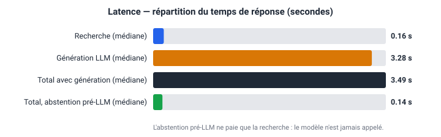
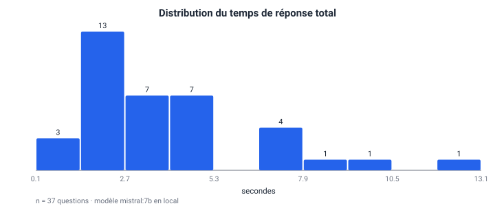
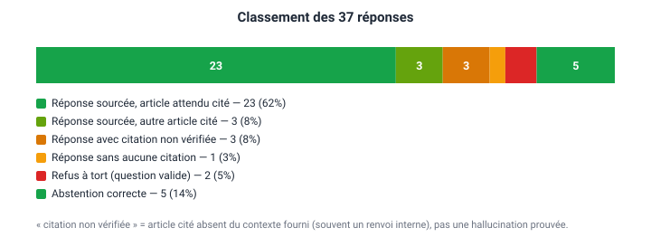
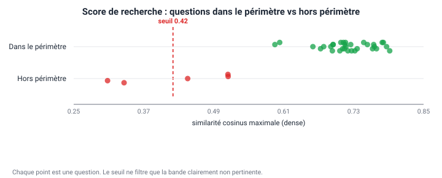
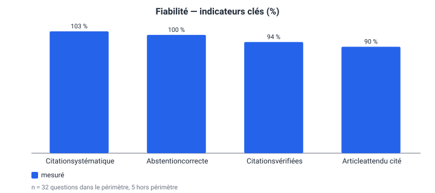

# Mesures de performance — Assistant juridique RAG

Jeu de référence : **32** questions dans le périmètre, **5** hors périmètre. Modèle local : `mistral:7b`.

> Toutes les valeurs de ce document sont produites par `python eval/run_measures.py` — aucune n'est saisie à la main.

## 1. Latence

| Étape | Médiane | Moyenne | p90 | Max |
|---|---|---|---|---|
| Recherche (toutes questions) | 0.16 s | 0.17 s | 0.18 s | 0.46 s |
| Génération LLM | 3.28 s | 3.93 s | 7.23 s | 12.93 s |
| **Total (avec génération)** | **3.49 s** | 4.11 s | 7.48 s | 13.08 s |
| **Total (abstention pré-LLM)** | **0.14 s** | 0.14 s | 0.14 s | 0.14 s |

Le garde-fou d'abstention divise le temps de réponse par **25×** sur les questions hors périmètre (0.14 s contre 3.49 s) : le modèle n'est pas appelé du tout.

La recherche représente environ **5 %** du temps total ; le reste est l'inférence du modèle local.

## 2. Classement des réponses

| Catégorie | Nombre | Part |
|---|---|---|
| Réponse sourcée, article attendu cité | 23 | 62 % |
| Réponse sourcée, autre article cité | 2 | 5 % |
| Réponse avec citation non vérifiée | 3 | 8 % |
| Réponse sans aucune citation | 1 | 3 % |
| Refus à tort (question valide) | 3 | 8 % |
| Abstention correcte | 5 | 14 % |

### Ce que ces catégories veulent dire

- **Réponse sourcée, article attendu cité** — le système répond et cite l'article de référence prévu par le jeu de test.
- **Réponse sourcée, autre article cité** — réponse fondée sur un article voisin. Souvent défendable en droit (p. ex. citer 337 au lieu de 336), à trancher au cas par cas.
- **Citation non vérifiée** — un numéro cité n'était pas dans le contexte fourni. Dans la pratique il s'agit surtout de **renvois internes** (« …prévu par l'article N ci-dessous ») repris depuis le texte d'un article bien fourni. Signal de vigilance, **pas** une hallucination démontrée.
- **Refus à tort** — question légitime refusée : c'est le coût d'une abstention trop stricte.
- **Répond alors qu'il devrait s'abstenir** — le cas le plus grave : le système produit une réponse sur un sujet absent du corpus.

## 3. Garde-fou d'abstention

- Questions dans le périmètre : score de **0.596** à **0.793**
- Questions hors périmètre : score de **0.307** à **0.515**
- Seuil retenu : **0.42**

Le seuil ne cherche pas à séparer le droit du travail des autres domaines juridiques — il ne filtre que la bande clairement non pertinente. Les questions juridiques hors corpus passent le seuil et sont rattrapées par l'abstention au niveau du prompt.

## 4. Fiabilité — indicateurs

## 5. Limite de mesure assumée

La vérification des citations contrôle qu'un article cité **figurait dans le contexte fourni** — pas qu'il **dise réellement** ce que la réponse lui attribue. Une réponse citant un article réel en en déformant le contenu est comptée ici comme sourcée. Détecter ce cas demanderait une vérification d'implication (entailment) ou une relecture humaine ; c'est hors périmètre du stage et documenté comme tel.

## 6. Détail par question

| Question | Type | Total (s) | Recherche (s) | Score | Attendu | Cité | Classement |
|---|---|---|---|---|---|---|---|
| Quelles sont les fautes graves pouvant justifier le licenciement d'un salarié ? | retrieval | 13.08 | 0.16 | 0.781 | 39 | 39, 40 | Réponse sourcée, article attendu cité |
| À partir de combien de salariés doit-on élire des délégués des salariés ? | retrieval | 9.78 | 0.25 | 0.767 | 430 | 433 | Réponse sourcée, autre article cité |
| Quelles obligations de sécurité et de santé l'employeur a-t-il envers ses salariés ? | retrieval | 8.30 | 0.17 | 0.717 | 24, 281 | 24, 287, 504, 542 | Réponse sourcée, article attendu cité |
| Quelle est la durée de la période d'essai pour un cadre en contrat à durée indéterminée ? | retrieval | 7.48 | 0.46 | 0.783 | 14 | 14 | Réponse sourcée, article attendu cité |
| Quelles catégories de salariés sont régies par des statuts spéciaux ? | retrieval | 7.39 | 0.16 | 0.695 | 3 | 4, 11 | Réponse sourcée, autre article cité |
| Quelle est la durée du congé de maternité ? | retrieval | 7.13 | 0.15 | 0.680 | 152 | 152, 154, 156, 269 | Refus à tort (question valide) |
| Comment est calculée l'indemnité de licenciement ? | retrieval | 6.67 | 0.15 | 0.788 | 53 | 53, 55, 56, 59 | Réponse sourcée, article attendu cité |
| Pour combien de temps peut-on conclure un CDD à l'ouverture d'une nouvelle entreprise ? | retrieval | 5.17 | 0.17 | 0.604 | 17 | 17 | Réponse sourcée, article attendu cité |
| L'employeur peut-il licencier une salariée enceinte ? | retrieval | 5.01 | 0.15 | 0.715 | 159 | 159, 160 | Réponse sourcée, article attendu cité |
| À quel âge un salarié est-il mis à la retraite ? | retrieval | 4.79 | 0.16 | 0.749 | 526 | 53, 526 | Réponse avec citation non vérifiée |
| Dans quel délai faut-il saisir le tribunal après un licenciement contesté ? | retrieval | 4.54 | 0.16 | 0.721 | 65 | 41, 65, 532 | Réponse avec citation non vérifiée |
| Le salarié doit-il être entendu avant d'être licencié ? | retrieval | 4.49 | 0.16 | 0.709 | 62 | 62 | Réponse sourcée, article attendu cité |
| Combien de jours de congé annuel payé acquiert-on par mois de service ? | retrieval | 4.34 | 0.16 | 0.696 | 231 | 231, 238 | Réponse sourcée, article attendu cité |
| Que doit faire un salarié malade pour justifier son absence ? | retrieval | 4.05 | 0.16 | 0.764 | 271 | 271 | Réponse sourcée, article attendu cité |
| Quelle est la durée minimale du repos hebdomadaire ? | retrieval | 3.97 | 0.16 | 0.661 | 205 | 206, 213 | Refus à tort (question valide) |
| À quel âge minimum un mineur peut-il être employé au Maroc ? | retrieval | 3.72 | 0.16 | 0.766 | 143 | 143, 145 | Réponse sourcée, article attendu cité |
| À partir de combien de salariés un comité de sécurité et d'hygiène est-il obligatoire ? | retrieval | 3.64 | 0.17 | 0.692 | 336 | 337 | Refus à tort (question valide) |
| Comment sont calculés les dommages-intérêts en cas de licenciement abusif ? | retrieval | 3.49 | 0.20 | 0.726 | 41 | 41, 51, 59 | Réponse avec citation non vérifiée |
| Quelle est la peine encourue pour vol qualifié ? | abstention | 3.36 | 0.15 | 0.445 | — | — | Abstention correcte |
| Une mère salariée a-t-elle droit à un repos pour allaiter son enfant ? | retrieval | 3.27 | 0.17 | 0.793 | 161 | 161 | Réponse sourcée, article attendu cité |
| Comment créer une société anonyme au Maroc ? | abstention | 3.09 | 0.14 | 0.515 | — | — | Abstention correcte |
| Combien d'heures par mois un délégué des salariés a-t-il pour exercer ses fonctions ? | retrieval | 2.61 | 0.17 | 0.712 | 456 | 456 | Réponse sourcée, article attendu cité |
| La discrimination salariale entre hommes et femmes est-elle autorisée ? | retrieval | 2.53 | 0.19 | 0.755 | 346 | 346 | Réponse sourcée, article attendu cité |
| Quelle est la durée légale du travail dans les activités non agricoles ? | retrieval | 2.28 | 0.17 | 0.737 | 184 | 184 | Réponse sourcée, article attendu cité |
| Peut-on employer un mineur de moins de 18 ans dans les mines ? | retrieval | 2.18 | 0.18 | 0.718 | 179 | 179 | Réponse sourcée, article attendu cité |
| À partir de combien de salariés faut-il créer un comité d'entreprise ? | retrieval | 2.11 | 0.16 | 0.674 | 464 | 464 | Réponse sourcée, article attendu cité |
| Un salarié appelé au service militaire retrouve-t-il son poste au retour ? | retrieval | 2.08 | 0.16 | 0.696 | 510 | 510 | Réponse sourcée, article attendu cité |
| Est-il permis de faire travailler les salariés pendant les jours de fête payés ? | retrieval | 1.92 | 0.16 | 0.714 | 217 | 217 | Réponse sourcée, article attendu cité |
| Quelle est la durée maximale d'une mission d'intérim ? | retrieval | 1.89 | 0.15 | 0.596 | 500 | — | Réponse sans aucune citation |
| Quelle est la procédure pour divorcer au Maroc ? | abstention | 1.72 | 0.15 | 0.515 | — | — | Abstention correcte |
| Combien de jours de congé un salarié a-t-il à l'occasion d'une naissance ? | retrieval | 1.68 | 0.16 | 0.771 | 269 | 269 | Réponse sourcée, article attendu cité |
| Combien de jours d'absence a-t-on pour son propre mariage ? | retrieval | 1.67 | 0.16 | 0.708 | 274 | 274 | Réponse sourcée, article attendu cité |
| À partir de quelle ancienneté la prime d'ancienneté est-elle due, et à quel taux ? | retrieval | 1.53 | 0.17 | 0.733 | 350 | 350 | Réponse sourcée, article attendu cité |
| Faut-il une autorisation pour recruter un salarié étranger ? | retrieval | 1.53 | 0.15 | 0.728 | 516 | 516 | Réponse sourcée, article attendu cité |
| Le harcèlement sexuel commis par l'employeur est-il une faute grave ? | retrieval | 1.20 | 0.16 | 0.716 | 40 | 39, 40 | Réponse sourcée, article attendu cité |
| Quelle est la recette du couscous royal ? | abstention | 0.14 | 0.14 | 0.307 | — | — | Abstention correcte |
| Quelle est la capitale de la France ? | abstention | 0.13 | 0.13 | 0.336 | — | — | Abstention correcte |
